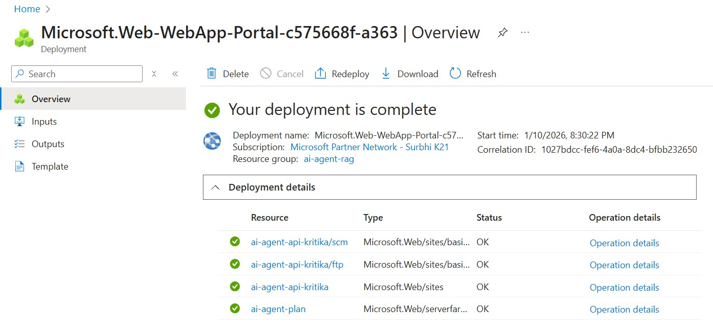
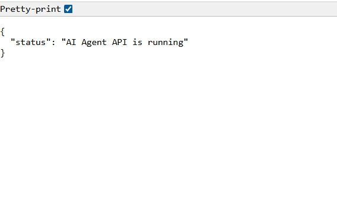
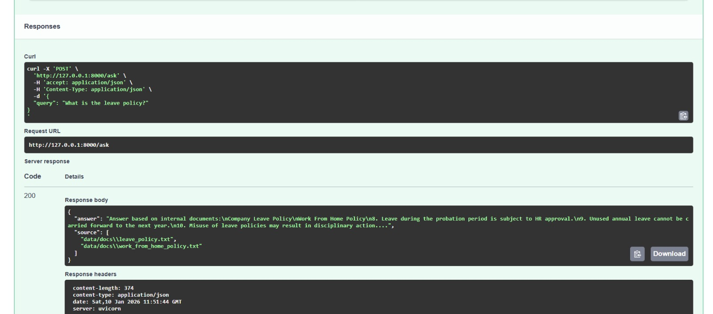

# AI Agent with RAG (Azure Deployment)

## Overview
This project implements an AI Agent that intelligently answers user queries either by:
- Responding directly using an LLM, or
- Retrieving relevant information from internal documents using Retrieval-Augmented Generation (RAG).

The system is exposed via a FastAPI backend and is designed for deployment on Azure App Service.

---

## Architecture Overview

**High-level Flow:**
1. User sends a query to the FastAPI `/ask` endpoint
2. AI Agent decides whether RAG is required
3. If required:
   - Relevant document chunks are retrieved from the vector store
   - Retrieved context is passed to the LLM
4. LLM generates a grounded response
5. API returns a structured response with answer and sources

**Components:**
- FastAPI Backend
- AI Agent (decision logic + memory)
- Vector Store (Chroma)
- Embeddings (HuggingFace)
- LLM (OpenAI / Azure OpenAI)

---

### 📌 Screenshots included:
- Azure App Service deployment
- API Health Check
- RAG-based query response

#### 1. Azure Deployment Successful
This shows that the FastAPI application is successfully deployed on Azure App Service.



---

#### 2. API Health Check - Application Running
This confirms that the FastAPI backend is running and accessible via the public URL. 



#### 3. RAG Working - Query Answered from Documents
This demonstrates Retrieval-Augmented Generation (RAG), where the agent retrieves relevant internal documents and answers the query based on them.

Example query:
> *"What is the leave policy?"*



---

## Tech Stack Used
- **Language:** Python
- **Backend Framework:** FastAPI
- **LLM:** OpenAI / Azure OpenAI
- **RAG Framework:** LangChain
- **Embeddings:** HuggingFace (`all-MiniLM-L6-v2`)
- **Vector Store:** Chroma
- **Deployment:** Azure App Service
- **CI/CD:** GitHub Actions

---

## Features Mapping to Assignment

### Task 1: AI Agent Development
- Accepts user queries
- Decides between:
  - Direct LLM response
  - RAG-based response
- Uses prompt engineering
- Implements tool calling (vector search)
- Supports session-based memory

### Task 2: RAG (Retrieval-Augmented Generation)
- Sample internal documents provided (text-based)
- Documents converted into embeddings
- Stored in Chroma vector store
- Relevant chunks retrieved and passed to LLM as context

### Task 3: Backend API
**Endpoint:** `POST /ask`

**Request:**
```
{
  "query": "string",
  "session_id": "optional"
}
Response:
{
  "answer": "string",
  "source": ["doc1", "doc2"]
}
```

### Task 4: Azure Deployment
- Application configured for Azure App Service
- Secrets managed via environment variables
- GitHub Actions used for deployment
- Application accessible via public URL (subject to Azure OpenAI quota)

---

### Setup Instructions
#### Local Setup
```
git clone https://github.com/kritika-droid/ai-agent-assignment.git
cd ai-agent-assignment
pip install -r requirements.txt
uvicorn main:app --reload
```
#### Access API:
```
http://127.0.0.1:8000
```
### Azure Setup (High-Level)
1. Create Azure App Service (Python)
2. Configure environment variables:
- OPENAI_API_KEY or AZURE_OPENAI_API_KEY
3. Set startup command:
```
gunicorn main:app --bind 0.0.0.0:8000 --workers 1 --timeout 600
```
4. Connect GitHub repository for CI/CD deployment

---

### Design Decisions
- FastAPI chosen for lightweight and fast API development
- Rule-based decision logic used for RAG vs direct LLM for simplicity
- Chroma selected as a lightweight vector store
- Lazy LLM initialization to avoid crashes due to missing API keys or quota
- Session-based memory stored in-process

---

### Limitations & Future Improvements
- Replace Chroma with Azure AI Search or Pinecone
- Improve decision-making using LLM-based routing
- Add persistent memory (Redis / Database)
- Dockerize the application
- Add Azure Monitor and structured logging
